# Web Component con LitElement - Botón de Carga Mathias Gualpa

## Descripción del Proyecto
Este proyecto implementa un Web Component personalizado usando LitElement que simula un botón de carga institucional para la Universidad de las Fuerzas Armadas ESPE. El componente demuestra las capacidades avanzadas de LitElement para crear elementos reutilizables y dinámicos.

---

## Estados Dinámicos en LitElement

### ¿Qué son los Estados Dinámicos?
Los estados dinámicos en LitElement son propiedades reactivas que automáticamente actualizan la vista cuando cambian sus valores. Esto se logra mediante el sistema de propiedades observadas de LitElement.

### Implementación en mi componente

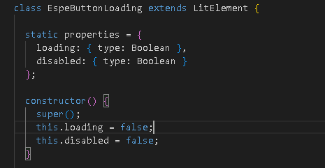  

### ¿Cómo funciona la reactividad?

- **Declaración:** Las propiedades se declaran en `static properties`.
- **Observación:** LitElement automáticamente observa cambios en estas propiedades.
- **Re-renderizado:** Cuando una propiedad cambia, se ejecuta automáticamente el método `render()`.
- **Actualización del DOM:** Solo se actualizan las partes del DOM que han cambiado.

### Ejemplo de cambio de estado

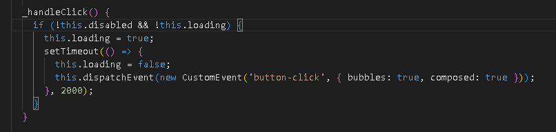  

---

## Eventos Personalizados para Integración

Los eventos personalizados permiten que los Web Components se comuniquen con el DOM padre sin crear dependencias directas, manteniendo el principio de encapsulación.

### Implementación en mi componente

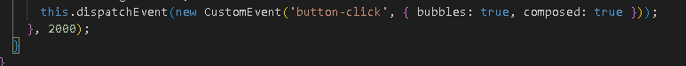  

### Implementación en otro componente

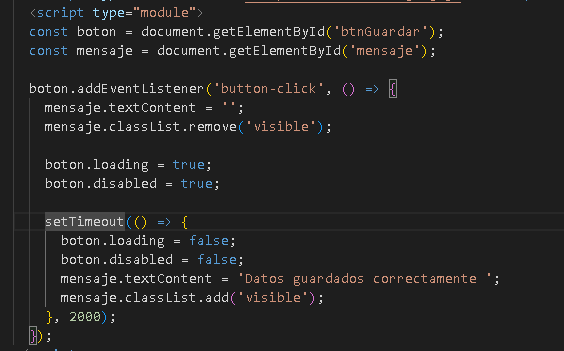  

### Ventajas de esta aproximación

- **Desacoplamiento:** El componente no necesita conocer su contexto de uso.
- **Reutilización:** El mismo componente puede usarse en diferentes contextos.
- **Mantenibilidad:** Cambios en el componente no afectan el código padre.
- **Escalabilidad:** Fácil integración en aplicaciones complejas.

---

# Comparación: JavaScript Puro vs LitElement

| Característica                  | JavaScript Puro                                                      | LitElement                                                     |
|--------------------------------|----------------------------------------------------------------------|----------------------------------------------------------------|
| Sistema de Propiedades Reactivas | `set loading(value) { this._loading = value; this.updateUI(); }`   | `static properties = { loading: { type: Boolean } };`          |
| Renderizado Eficiente           | `updateUI() { this.innerHTML = \`<button>\${this.loading ? 'Cargando...' : 'Enviar'}</button>\`; }` | `render() { return html\`<button>\${this.loading ? 'Cargando...' : 'Enviar'}</button>\`; }` |
| Gestión de Estilos              | `button.style.backgroundColor = 'red';`                            | `static styles = css\` button { background-color: var(--primary-color); } \`;` |

# Pruebas realizadas

## 1. Custom Element Válido 

- Código del registro del componente:  
  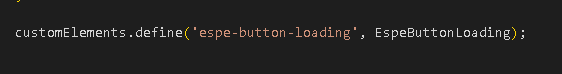

- Extensión de LitElement:  
  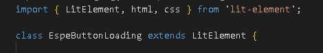

- Uso en HTML:  
  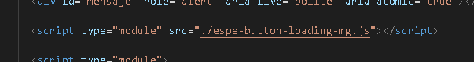

- Inspección en DevTools: Mostrar el elemento personalizado en el árbol DOM  
  

---

## 2. Uso de Estados Dinámicos 

- Declaración de propiedades reactivas:  
  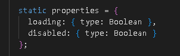

- Cambio de estado en acción (línea con `this.loading = true;`):  
  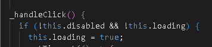

- Renderizado condicional:  
  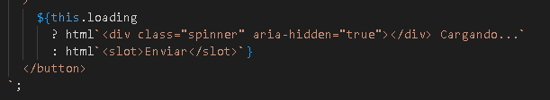

- Captura del botón en ambos estados: Normal y Cargando  
  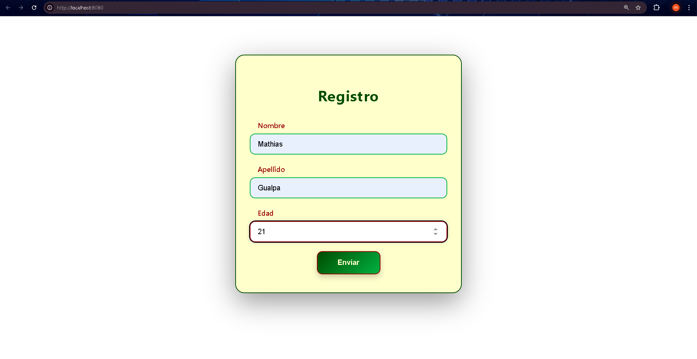  
  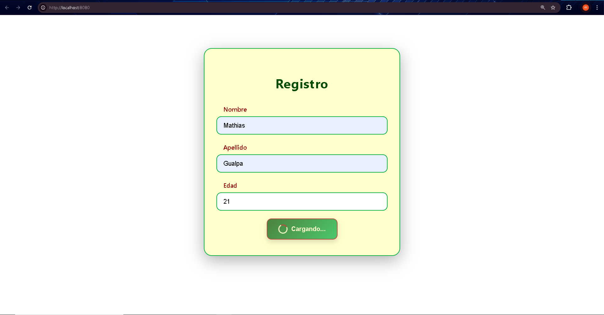

---

## 3. Estilos y Temas ESPE 

- Estilos encapsulados (declaración `static styles = css`):  
  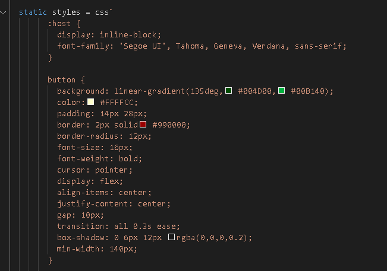

- Resultado visual: Formulario completo con colores ESPE aplicados  
  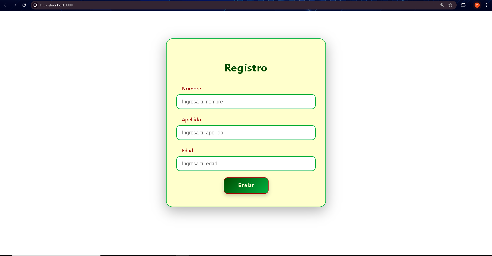

---

## 4. Eventos y Comunicación 

- Creación del evento personalizado (`this.dispatchEvent(new CustomEvent(...))`):  
  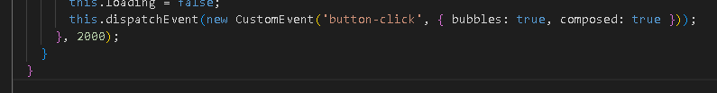

- Escucha del evento (`addEventListener` y lógica asociada):  
  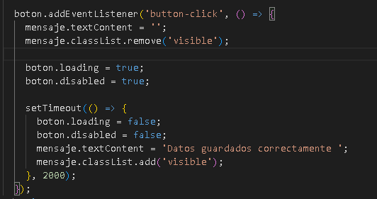

---

